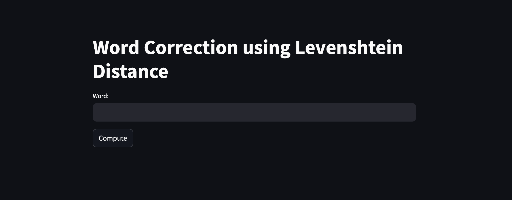
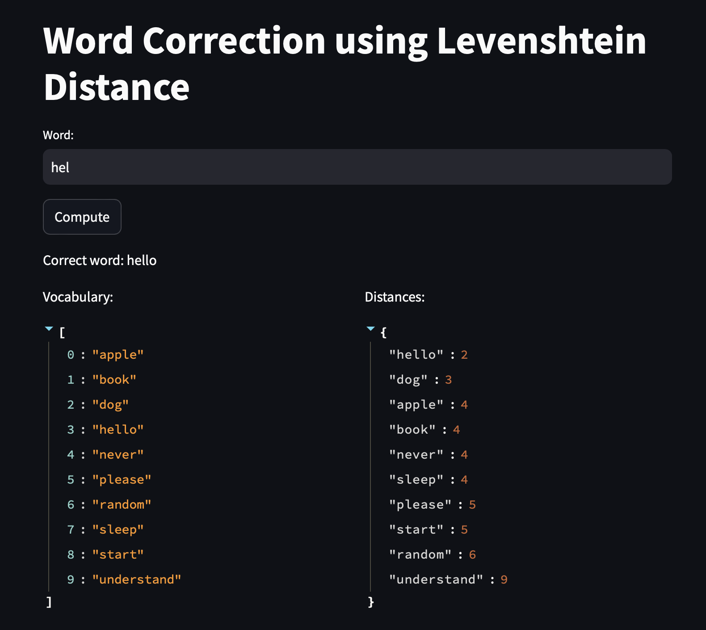
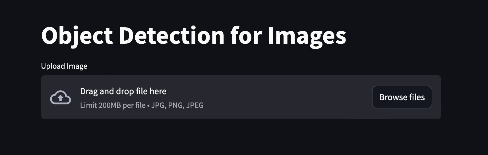
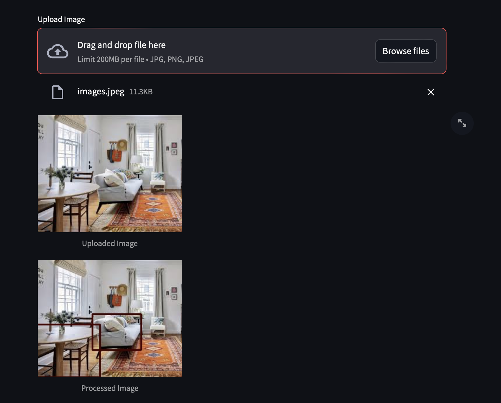
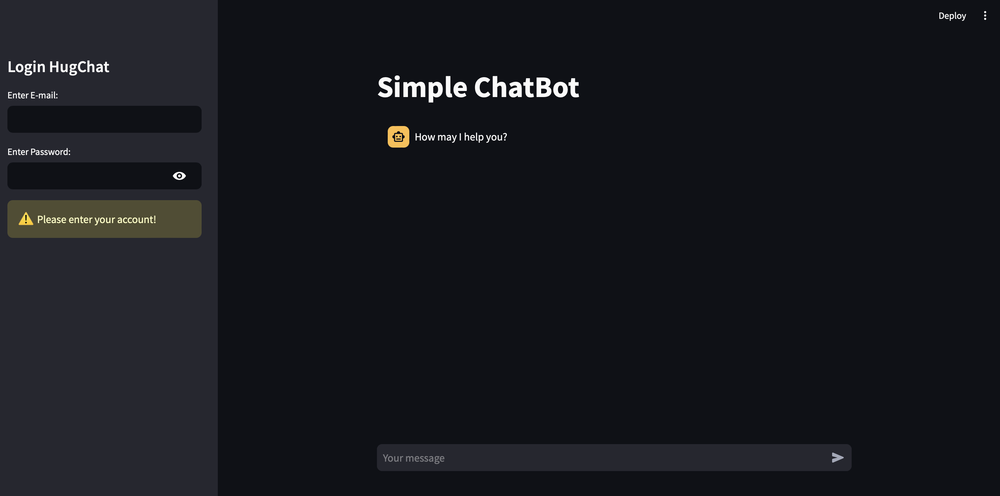

# aio2024_streamlit_project
Projects using Streamlit to deploy. There are 3 projects in this repository:
1. Word correction using Levenshtein distance
2. Object detection using DNN from OpenCV 
3. Chatbot uising hugchat from huggingface
The following instructions will help you to deploy and use this 3 simple applications.

**Clone the repository:**
+ For Windows: !git clone https://github.com/chaupmbn/aio2024_streamlit_project.git
+ For MacOS: !git clone git@github.com:chaupmbn/aio2024_streamlit_project.git

## Project 1: Word correction
1. Open the application on browser:
    + Open Terminal and run the command: streamlit run */aio2024_streamlit_project/word_correction/levenshtein_distance.py (replace * with appropriate path)
    + The application is opened at http://localhost:8501 as picture belows:
    
2. Enter a word at "Word" text box and click "Compute" button, a sample as picture belows:
    

## Project 2: Object detection
1. Open the application on browser:
    + Open Terminal and run the command: streamlit run */aio2024_streamlit_project/object_detection/object_detection.py (replace * with appropriate path)
    + The application is opened at http://localhost:8501 as picture belows:
    
2. Click "Browses file" button and upload an image (up to 200MB per file)
3. A result as picture belows:
    
    Some objects in the "Processed image" are put inside bounding boxs. That means the application successfully detected objects in image.

## Project 3: Chatbot
1. You have to register a HuggingFace account and authorize to connect Hugchat at [Link](https://huggingface.co/chat/)
2. Open the application on browser:
    + Open Terminal and run the command: streamlit run */aio2024_streamlit_project/chatbot/chatbot.py (replace * with appropriate path)
    + The application is opened at http://localhost:8501 as picture belows:
    
3. Log in to your HuggingFace at the right-top corner.
4. Enter your request at "Your message" text box at the bottom

THANK YOU!
    

